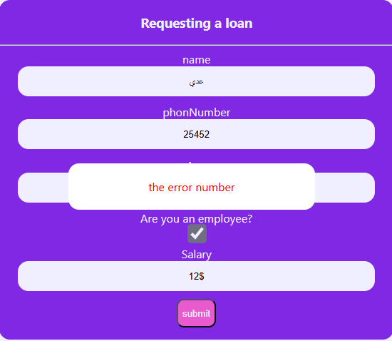

# Bank-user-interface

## Overview

This project is a simple React.js user input form that collects and validates the following information from the user:

- **Name**
- **Age**
- **Phone Number**
- **Salary**

## Features

- **Age Validation:**

  - The input must be a number.
  - The age must be between 18 and 100 inclusive.

- **Phone Number Validation:**

  - The phone number must be between 8 and 12 digits long.

- **Salary Input:**
  - No specific validation applied to the salary input.

## Project Structure

/src
├── components
│ ├── Alert.js # Component for displaying error messages
│ ├── Header.js # Header component containing other components
├── App.js # Root component
├── index.js # Entry point of the application
└── styles.css # Styling for the form

## Installation

1. **Clone the repository:**

   bash
   git clone https://github.com/OdaySalah/Bank-user-interface.git
   cd Bank-user-interface

2) **Install dependencies:**

   bash
   npm install

3. **Run the development server:**

   bash
   npm start

## Usage

1. **Input Fields:**

   - **Name:** Free text input.
   - **Age:** Enter a number between 18 and 100. The form will reject non-numeric inputs and numbers outside this range.
   - **Phone Number:** Enter a number between 8 and 12 digits long. The form will validate that the input is within this range.
   - **Salary:** Enter any numerical value.

2. **Form Submission:**
   - The form can only be submitted when all validation criteria are met.
   - An error message will be displayed using the `Alert` component if any validation fails.

## Screenshot

